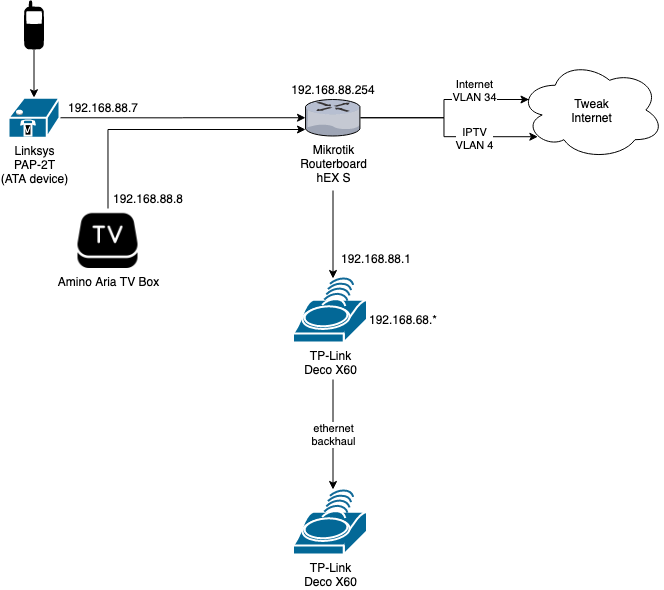

# Tweak Fiber (FTTH) configuration for Mikrotik RouterOS

## Introduction

I have written this manual as an explanation of how [Tweak](https://www.tweak.nl/) Fiber To The Home (FTTH) has to be configured, using your [own hardware](https://www.tweak.nl/support/apparatuur-configureren.html). There is quite some information available on the internet, but none of them were fully clear to me. Hence, with this Github page I try to provide you with more information, such that you understand how it works. Please note, I am a software engineer (Scala or Java) with Devops skills, I am **not** a platform engineer nor a network engineer. My intended audience are IT people, who have a basic understanding of networking and would like to use their own hardware.

### Reasons for using own hardware

I had a [Zyxel VMG8324-B10A](https://www.tweak.nl/glasvezel/apparatuur.html) modem from Tweak. This device allows a lot of configuration, but still frustrates me a lot:

- It is very slow (especially during boot)
- Sometimes internet/tv hangs, so I had to reboot it (or twice or more)
- TV signal is/was distorted sometimes, especially during recordings and 'Uitzending Gemist', which is most likely caused by the servers of Tweak. The service desk often first checks my own hardware, which I can understand, but after having this reported repeatedly and repeating it over and over, it started frustrating me.

## Network topology

Below you will find a topology drawing of my network setup. I have added my internal IP addresses to it, such that my configuration is easier to understand.



Hardware | Description
------------ | -------------
[Mikrotik hEX S](https://tweakers.net/pricewatch/1183841/mikrotik-hex-s.html) | Relative cheap Gigabit router (60 euro), which is fast enough for my setup.
[Amino Aria tv box](https://www.tweak.nl/tv/apparatuur-voor-tv.html) | The TV box used by [Canal Digital](https://www.tweak.nl/tv/canal-digitaal-tv-via-internet.html)
[Linksys PAP-2T ATA device](https://nl.aliexpress.com/w/wholesale-linksys-pap2t.html) | The [ATA device](https://en.wikipedia.org/wiki/Analog_telephone_adapter) to enable VOIP
[TP-Link Deco X60](https://tweakers.net/pricewatch/1625456/tp-link-ax3000-whole-home-mesh-wi-fi-system-deco-x60-2-pack.html) | A good WiFi Mesh with an ethernet backhaul (you need a UTP cable between them for best performance). I bought a cheap one as a sales offer. All internal devices are connected to this WiFi Mesh.

> I didn't replace the [ISRA](https://nl.wikipedia.org/wiki/ISRA), more specifically the media converter Genexis FiberXport, because I wasn't sure whether I am allowed to just rip it off. Theoretically, I could use my own SFP module and connect it directly to the router (`sfp1`) . For now, I use the `ether1` port for internet.

### Speed

I do read on the internet that the hEX S (or hEX router family) may not be fast enough for gigabit internet. I did some simple tests with my Deco X60 Mesh routers and my upload and download speeds are between 500Mbit and 800 MBit.

## Configuration

The basic Tweak settings can be found [here](https://www.tweak.nl/support/apparatuur-configureren.html). It is also recommended to make a screenshot of your Zyxel status page, an example can be found [here](./images/zyxel-status-page.jpg). I use some of the MAC addresses to mimic the Zyxel router. I assume you have a Zyxel router and you connect to the router using [Winbox](https://mikrotik.com/download).

### Package multicast

There is slightly a chicken and an egg problem. In order to get TV working, you should install the `multicast` package to get the `igmp-proxy` stuff working (for IPTV). So, your first step is to:

1. Download `all-packages-{architecture}` from [https://mikrotik.com/download](https://mikrotik.com/download). The architecture for the hEX S is `MMIPS` and the row you need is `Extra packages`.
2. Extract and copy the `multicast` package into Winbox file screen
3. Reboot router and package should be installed

To understand how to install packages on a Mikrotik RouterBoard: [https://systemzone.net/how-to-install-extra-packages-in-mikrotik/](https://systemzone.net/how-to-install-extra-packages-in-mikrotik/)

### Internet and IPTV

The full configuration file can be found [here](./mikrotik_router.cfg.rsc), you can download this file, but you need to modify some parts. Let's walk you through the file.

```
/interface bridge
add admin-mac={LAN_INFORMATION_MAC-ADDRESS} arp=proxy-arp auto-mac=no comment="Lokaal netwerk" igmp-snooping=yes name=bridge_local protocol-mode=none
add admin-mac={WAN_INFORMATION_MAC-ADDRESS} auto-mac=no name=bridge_vlan34_wan
```

We use two bridges, because we need one for internet (and TV) and one for our internal network. In order to keep everything the same as your Zyxel router, fill in the MAC addresses as described above from the Zyxel status page.

```
/interface ethernet
set [ find default-name=ether1 ] arp=proxy-arp l2mtu=1598 loop-protect=off
set [ find default-name=sfp1 ] disabled=yes
```

We use `ether1` for internet and not `sfp1`.

```
/interface vlan
add interface=ether1 name=vlan1.4 vlan-id=4
add interface=bridge_vlan34_wan loop-protect=off name=vlan1.34 vlan-id=34
```

So TV goes over vlan 4 and internet over 34. We use the bridge for internet, since that uses also the correct MAC address. You can't put vlan 4 also in that bridge, because then the same MAC address is used when doing the DHCP request and that doesn't work. Please try to remember the `name` values, we will use them later on.

```
/interface wireless security-profiles set [ find default=yes ] supplicant-identity=MikroTik
```

You may want to change this to something else, doesn't really matter.

```
/ip dhcp-client option add code=121 name=classless-static-route-option value=0x{TWICE_IPTV_MAC_WITHOUT_COLONS}
```

IPTV only works when you use the correct gateway routes and that's done using the [DHCP 121 option](https://wiki.mikrotik.com/wiki/Manual:IP/DHCP_Server). I am not sure about whether to provide a value, but I followed [this manual](https://wiki.mikrotik.com/wiki/Manual:IP/DHCP_Server). The value of `value` is twice the `IPTV MAC ADDRESS` without colons. For example, your IPTV MAC address is `AB:CD:EF:12:34:56`, then the value is `0xABCDEF123456ABCDEF123456`). Again, I am not sure whether this values is required or not.

```
/ip pool add name=thuis ranges=192.168.88.1-192.168.88.100

/ip dhcp-server add address-pool=thuis disabled=no interface=bridge_local name=dhcp_local_lan
```

My internal network of my Mikrotik RB uses `192.168.88.*`, that will be leased by the DHCP server I configure here.

```
/routing bgp instance set default disabled=yes
```

A setting that I found in some references I read on the internet (see below). Just to be sure to put BGP off.

```
/interface bridge port
add bridge=bridge_vlan34_wan interface=ether1
add bridge=bridge_local comment="Bridge LAN Internet" interface=ether2
add bridge=bridge_local comment="Bridge LAN Internet" interface=ether3
add bridge=bridge_local comment="Bridge LAN Internet" interface=ether4
add bridge=bridge_local comment="Bridge LAN Internet" interface=ether5
```

Here I configure the bridges. IPTV is already on `ether1`. Internet is added too by adding `ether1` to `bridge_vlan_34`. So now both vlan 4 and 35 can do their work on `ether1` properly. All other ports are put into the internal network (`bridge local`).

```
/interface detect-internet set detect-interface-list=all wan-interface-list=dynamic
```

Not sure about this setting, but I think it it automatically detects wan-interface (`ether1`)

```
/ip address add address=192.168.88.254/24 comment="Router IP address" interface=bridge_local network=192.168.88.0
```

The internal part lives in `192.168.88.*` (we also saw in the DHCP range), the router is on `192.168.88.254`.

```
/ip dhcp-client 
add comment="DHCP WAN Tweak" disabled=no interface=vlan1.34
add add-default-route=special-classless comment="DHCP IPTV Tweak" default-route-distance=255 dhcp-options=hostname,clientid,classless-static-route-option disabled=no interface=vlan1.4 use-peer-ntp=no
```

Here we do two things, for internet do a DHCP client request on VLAN `34` for internet. More interesting is the second part (third line), then we do a DHCP request for IPTV on VLAN `4` (through `interface-vlan1.4`). Important to note, is that we add the `121` option code (`classless-static-route-option`) and set a default route distance of 255. The reason for doing this, is because we have to route TV data to this gateway. As we will later see, we need this information to verify our static TV routes. We put there `255`, because if we put the distance to `1`, then all the traffic (including internet) would go over here and then internet doesn't work. We dive into this later again, when we set a static TV route.

```
/ip dhcp-server lease
add address=192.168.88.7 comment="Linksys PAP2T" mac-address={MAC_OF_LINKSYS_PAP2T} server=dhcp_local_lan
add address=192.168.88.1 comment="Deco X60 1" mac-address={MAC_OF_DECO_X60_MAIN_SATTELITE} server=dhcp_local_lan
add address=192.168.88.2 comment="Deco X60 2" mac-address={MAC_OF_DECO_X60_SECOND_SATTELITE} server=dhcp_local_lan
add address=192.168.88.8 comment="Amino TV Box" mac-address={MAC_ADDRESS_OF_AMINO_BOX} server=dhcp_local_lan
```

I prefer to keep devices static, so I can access them more easily. Also, you should set the Amino box to a static IP, because we need to forward TV traffic to it in order to get pauzing and recordings working. We will dive into that later.

```
/ip dhcp-server network add address=192.168.88.0/24 dns-server=192.168.88.254 domain=thuis.local gateway=192.168.88.254 netmask=24
```

Internal DHCP lease configuration. Please note I set the DNS to my router.

```
/ip dns set allow-remote-requests=yes cache-max-ttl=1d servers=8.8.8.8,8.8.4.4
```

Also configure the Google DNS, which is fast and stable. A note on `allow-remote-requests`. I needed to do that, to get DNS working at all. The bad side of this, is that at this point, everybody on the internet can use me as a DNS server. We don't want that and we will fix that soon in our firewall configuration.

```
/ip firewall address-list
add address=0.0.0.0/8 comment="Self-Identification [RFC 3330]" list=Unrouted
add address=10.0.0.0/8 comment="Private class A" list=Unrouted
add address=127.0.0.0/8 comment="Loopback [RFC 3330]" list=Unrouted
add address=169.254.0.0/16 comment="Link Local [RFC 3330]" list=Unrouted
add address=172.16.0.0/12 comment="Private class B" list=Unrouted
add address=192.0.2.0/24 comment="Reserved - IANA - TestNet1" list=Unrouted
add address=192.88.99.0/24 comment="6to4 Relay Anycast [RFC 3068]" list=Unrouted
add address=198.18.0.0/15 comment="NIDB Testing" list=Unrouted
add address=198.51.100.0/24 comment="Reserved - IANA - TestNet2" list=Unrouted
add address=203.0.113.0/24 comment="Reserved - IANA - TestNet3" list=Unrouted
add address=192.168.0.0/16 comment="Private class C" list=Unrouted
```

A list with the name `Unrouted` with all IP4 addresses that should never be routed when received from the outside. We will use this list in our firewall.

```
/ip firewall filter
``` 

My firewall rules (to understand the basics, read [this](https://help.mikrotik.com/docs/display/ROS/Building+Your+First+Firewall)). Let's examine them one by one.

```
add action=accept chain=forward comment="Accept only established and related" connection-state=established,related
add action=fasttrack-connection chain=forward comment="Fast forward connections" connection-state=established,related
add action=accept chain=input comment="Forward established en related WAN" connection-state=established,related in-interface=vlan1.34
add action=accept chain=forward comment="Accept DST traffic" connection-nat-state=dstnat in-interface=vlan1.34
```

Accept and fast track connection to speedup, the last two lines can be redundant, not sure. Difference is the interface it's for.

```
add action=accept chain=forward comment="Accept DST traffic" connection-nat-state=dstnat in-interface=vlan1.34
```

Allow DST traffic to get NAT properly working.

```
add action=drop chain=forward comment="Drop invalid WAN connections" connection-state=invalid in-interface=vlan1.34
```

Drop connections that shouldn't be here

```
add action=drop chain=input comment="Protect from external DNS calls" dst-port=53 in-interface=vlan1.34 protocol=udp
add action=reject chain=input comment="Protect from external DNS calls" dst-port=53 in-interface=vlan1.34 protocol=tcp reject-with=icmp-host-unreachable
```

Remember that DNS allows external calls. Here we block it from the internet, so only from the internal network DNS requests can be made. This is good, this is important!

```
add action=reject chain=input comment="Reject icmp traffic" in-interface=vlan1.34 protocol=tcp reject-with=icmp-port-unreachable
add action=reject chain=input in-interface=vlan1.34 reject-with=icmp-network-unreachable
add action=reject chain=input in-interface=vlan1.34 reject-with=icmp-network-unreachable
add action=drop chain=input dst-address={YOUR_PUBLIC_IP} protocol=icmp
```

Reject ICMP, ping..etc. We don't want that. Also, we use `YOUR_PUBLIC_IP` to ensure that pings to you are blocked. We will dive into these public IPs later.

```
add action=drop chain=forward comment="Drop unrouted addresses" in-interface=vlan1.34 src-address-list=Unrouted
add action=drop chain=forward comment="Drop all from WAN not DSTNATed" connection-nat-state=!dstnat connection-state=new in-interface=vlan1.34
```

Drop external packages with these unroutable IP addresses (see above). You should never accept them. Also drop all incoming connections that are not NAT. We don't want them.

```
add action=accept chain=input comment="IPTV multicast" dst-address=224.0.0.0/8 in-interface=vlan1.4
add action=accept chain=forward in-interface=vlan1.4 protocol=udp
add action=accept chain=forward comment="IPTV multicast" dst-address=224.0.0.0/8 in-interface=vlan1.4
```

This is for IPTV and a bit of a hack. I got it from some other resources (see below). It just allows IPTV data in my network.

```
/ip firewall nat
```

The port forwarding and masquerading part, see [here](https://help.mikrotik.com/docs/display/ROS/NAT) for the basics. Let's go over them one by one.

```
add action=masquerade chain=srcnat comment="Masquerade internet traffic" src-address=192.168.88.0/24
```

All packages must be [masqueraded](https://en.wikipedia.org/wiki/Network_address_translation), else it won't work at all. 
We use the `192.168.88.0/24` range, since everything will have such an IP. This will also masquerade stuff internally, in case you want to connect from LAN to your public IP. 

```
add action=dst-nat chain=dstnat comment="All dst-nat on VLAN4 to TV box to ensure clean streaming since there is no RTSP protocol on Mikrotik" dst-address=!224.0.0.0/8 in-interface=vlan1.4 to-addresses=192.168.88.8
```

This is also some sort of hack which I took from Tweakers forum. Since [RTSP protocol](https://en.wikipedia.org/wiki/Real_Time_Streaming_Protocol) is not really supported, we need to forward all ports regarding IPTV to the Amino TV Box (hence the static IP for it). If you don't do this, most likely pausing and watching back TV doesn't work properly. Also note, connecting a second Animo box is not really possible this way. But that's something I don't use.

```
add action=dst-nat chain=dstnat comment="Example FTP forward" dst-port=21 protocol=tcp to-addresses=192.168.88.1 to-ports=21
add action=dst-nat chain=dstnat comment="Example FTP PASV forward" dst-port=3500 dst-address={YOUR_PUBLIC_IP} protocol=tcp to-addresses=192.168.88.1 to-ports=3500
```
Example port forward of FTP. Please note the [FTP Passive](https://en.wikipedia.org/wiki/File_Transfer_Protocol) mode. If you want to be able to forward this nicely, you need to configure your public IP in, then this rule works from in- and outside your network.

#### Your (static) public IP
You sometimes need to set your public IP. This IP may change, the following should be taken into account
- To deal with this easily, you can use [Mikrotik Cloud DDNS](https://help.mikrotik.com/docs/display/ROS/Cloud). This is also under `IP` -> `Cloud`. If you set the DDNS, you will get a DNS from Mikrotik, which looks like `xxx.sn.mynetname.net`. 
- You can use this DNS in the firewall (as IP list), then your dynamic IP is automatically updated
- The disadvantage of this, is that your IP is now on the internet, so you can do two things:
   - You don't care
   - Use a VPN connection
   - Handle changes manually, especially when most of the time it's a static value

```
/ip firewall service-port
set ftp disabled=yes
set tftp disabled=yes
set irc disabled=yes
set h323 disabled=yes
set sip disabled=yes
set pptp disabled=yes
set udplite disabled=yes
set dccp disabled=yes
set sctp disabled=yes
```

I disable all protocols on the Routerboard, also SIP, because we don't have to use it like this. This is more secure.

```
/ip route
add comment=TV_static_route1 distance=1 dst-address=185.24.175.0/24 gateway=10.10.32.1
add comment=TV_static_route2 distance=1 dst-address=185.41.48.0/24 gateway=10.10.32.1
```

Now, this may be a bit strange, but this has to do with the IPTV [static routes](https://www.tweak.nl/support/apparatuur-configureren.html) you have to set. That's what these two lines do, else pause and recordings won't work properly. Now, the `10.10.32.1` is the hardest part to understand. Recall, that we send a `121` during the IPTV DHCP request on `vlan 4` to get the gateway addresses. These addresses are added to routing table with distance `255`, else internet breaks. Now if you have executed this, you should look into the IP routing table of your Mikrotik RB. An example of this list can be seen [here](./images/route_list.png) (under `IP` -> `routing`). Ensure all routes reachable, especially this static one. Also, lookup the received IPTV gateway IP, it should be equal to
the `dst-address`. Hopefully this is clear enough, else experiment with it.

```
/ip service
set telnet disabled=yes
set ftp disabled=yes
set www disabled=yes
set ssh disabled=yes
set api disabled=yes
set api-ssl disabled=yes
```

Don't allow anything except Winbox. Only connect to the RB using Winbox.

```
/ip upnp set show-dummy-rule=no

/ip upnp interfaces add interface=bridge_local type=internal
```

Some UPNP stuff, yes some people hate it, some people like it. I allow it here.

```
/routing igmp-proxy set quick-leave=yes
/routing igmp-proxy interface
add alternative-subnets=0.0.0.0/0 interface=vlan1.4 upstream=yes
add
add interface=bridge_local
```

This part set the `igmp-proxy` stuff for IPTV. Ensure that you have installed the `multicast` package (see above) else it won't work. Without this proxy, your whole network could be much slower.

```
/system clock set time-zone-name=Europe/Amsterdam
```

Set the region and time of the RB

```
/user add name={MY USERNAME} password={PASSWORD} group=full
/user remove admin
/user set {MY USERNAME} allowed-address=192.168.88.0/24
```

Configure a default user `{MY USERNAME}` and remove the admin one. Set a secure password and only allow logins from internal IP. This makes everything much more secure.

### Telephony & VOIP

I use a [Linksys PAP2T](https://nl.aliexpress.com/w/wholesale-linksys-pap2t.html) to get telephony working. Here I share my configuration for this.

**Before you continue, you must contact the Tweak service desk to get your SIP password from Tweak. They email you all the information and you this else it won't work.**

1. Login to the device. As you can see above, I have set a static IP to the device. Go to the URL with your browser.
2. Click on `Admin Login` and login as admin, switch to `Advanced view`
3. Go to the `System` tab and
    - Set a new user password and admin password, which is a good idea.
    - DHCP: `Yes`
    - Domain: `sip.tweakphone.nl`
    - Primary DNS: `8.8.8.8` & secondary DNS: `8.8.4.4`
    - Primary NTP Server: `0.nl.pool.ntp.org`, Secondary NTP Server: `1.nl.pool.ntp.org`.
4. Go to the `SIP` tab and:
    - `RTP Port Min`: `9000`
    - `RTP Port Max`: `10999`
    - `Handle VIA Received`: `yes`
    - `Insert VIA received`: `yes`
    - `Handle VIA rport`: `yes`
    - `NAT Keep Alive Intvl`: `90`
5. On the `Regional` tab:
    - `Time Zone`: `GMT +02:00`
6. On the `Line 1` tab:
    - `Line enable`: `Yes`
    - `NAT Mapping Enable`: `yes`
    - `NAT Keep Alive Enable`: `yes`
    - `NAT Keep Alive Msg`: `$SIP`
    - `NAT Keep Alive Dest`: `$PROXY`
    - `SIP Port`: `5060`
    - `EXT SIP Port`: `5060`
    - `Proxy`: `sip.tweakphone.nl`
    - `Outbound Proxy`: `sip.tweakphone.nl`
    - `Use Outbound Proxy`: `yes`, not sure if the outbound proxy is necessary..
    - `Register`: `Yes`
    - `Register Expires`: `150`, seconds...not too high, else you get connection closed.
    - `Use DNS SRV`: `yes`
    - `Proxy Fallback Intvl`: `150`, also not too high
    - `Make Call Without Reg`: `yes`
    - `Ans Call Without Reg`: `yes`
    - `Display Name`: `{FULL PHONE NUMER}`, e.g. `0031731184239`.
    - `User ID`: `{USER NAME}`, should be provided by Tweak and is basically your phone number. From the example it should be `31731184239`
    - `Password`: `{PASSWORD}`, provided by Tweak. Contact Servicedesk.
    - `Dial Plan`, depends on the location you live in The Netherlands. For Amsterdam (`020`) it should look like: `(<:003120>[1-9]xxxxxxS0|<0:0031>[1-7]xxxxxxxxS0)`
    - `Emergency Number`: `112`
7. Press `Save Settings`. In the `Info` tab you should see `Registration State:    Online`. Try to make a phone call.

## Resources

I used several resources, which I want to mention here and thank them for helping me.

- [WifiNederland](https://www.wifinederland.nl/mikrotik-rb3011-i-c-m-provider-tweak-glasvezel/) provides a Tweak configuration for a Mikrotik RouterBoard. The configuration is a bit too extensive (disabled rules, some lines are redundant) and there is no real description or explanation. Nevertheless, it helped me with understanding how it works!
- [Netwerkje.com](https://netwerkje.com/), contains a KPN Fiber configuration for Mikrotik RB. Describes (in Dutch) what and how they do things. Also helped me a lot! Please note that KPN uses a PPPoE connection.
- [Tweakers forum](https://gathering.tweakers.net/). A (huge) place with a lot of information about anything related to IT. Helped me out regarding configuring the static IPs.

